# Serverless Social Graph Sample

이 저장소는 실제 프로덕션 환경에서 구현했던 AppSync + DynamoDB 기반 소셜 기능 패턴을 포트폴리오용으로 재구성한 sanitized sample입니다. 회사의 독점 소스 코드, 내부 인프라 정보, 고객 데이터, 비밀키, 내부 비즈니스 로직은 포함하지 않습니다.

## 문제 정의

커뮤니티 서비스의 좋아요, 팔로우, 댓글, 댓글 반응 기능은 단순히 row 하나를 쓰는 작업이 아닙니다. 액션 row와 aggregate counter가 함께 바뀌기 때문에 일부 write만 성공하면 사용자 프로필의 카운터, 게시글/댓글의 반응 수, 관계 테이블이 서로 어긋날 수 있습니다.

이 샘플은 아래 정합성 문제를 다룹니다.

- 좋아요 생성/삭제와 `post.likes`, 사용자별 `postLikeSent/postLikeRecv` 동기화
- 팔로우 생성/삭제와 `followersCount/followingCount` 동기화
- 댓글 생성과 `post.comments`, `user.commentsCount` 동기화
- 댓글 reaction 전환(`NONE`, `LIKED`, `DISLIKED`) 시 댓글 및 사용자 counter 동기화
- 게시글/댓글 삭제 시 작성자 aggregate counter 보정

## 아키텍처



원본 프로젝트에서 사용했던 방식처럼, 단순한 social graph mutation은 AppSync JS resolver의 `TransactWriteItems`를 사용하고, 게시글/댓글 생성처럼 서버에서 ID 생성과 여러 테이블 orchestration이 필요한 작업은 Lambda resolver로 분리했습니다.

## 데이터 모델

| Table | 역할 |
| --- | --- |
| `UsersTable` | 사용자 프로필 및 aggregate counter |
| `PostsTable` | 게시글 본문, 작성자, 좋아요/댓글 수 |
| `CommentsTable` | 댓글 본문, 작성자, 좋아요/싫어요 수 |
| `LikesTable` | 사용자별 게시글 좋아요 관계 |
| `RelationshipsTable` | `FOLLOWS_{userId}` sort key 기반 팔로우 관계 |
| `CommentReactionsTable` | 사용자별 댓글 reaction 상태 |

## Transaction 설계

주요 mutation은 하나의 `TransactWriteItems` 요청으로 entity write와 counter update를 묶습니다.

- `like`: `LikesTable` Put + `PostsTable.likes +1` + 사용자 sent/received counter 갱신
- `unlike`: `LikesTable` Delete + `PostsTable.likes -1` + 사용자 sent/received counter 감소
- `follow`: `RelationshipsTable` Put + follower `followingCount +1` + followee `followersCount +1`
- `unfollow`: 관계 삭제 + 양쪽 counter 감소
- `reactComment`: reaction row 갱신/삭제 + 댓글 `likes/dislikes` delta + 사용자 comment reaction counter delta
- `deletePost/deleteComment`: soft delete 또는 delete와 작성자 aggregate counter 보정

중복 좋아요/팔로우와 존재하지 않는 row 갱신을 막기 위해 `attribute_exists`, `attribute_not_exists` 조건식을 함께 사용합니다.

## 원본성 유지 방식

샘플의 핵심 resolver는 원본 프로젝트에서 사용했던 AppSync JS resolver 구조를 최대한 유지했습니다.

- `src/resolvers/Mutation.like.js`
- `src/resolvers/Mutation.unlike.js`
- `src/resolvers/Mutation.follow.js`
- `src/resolvers/Mutation.unfollow.js`
- `src/resolvers/pipeline/SetCommentReaction.js`
- `src/resolvers/pipeline/RemovePostAndUpdateUserCounter.js`
- `src/resolvers/pipeline/RemoveCommentAndUserCounter.js`

로컬 테스트를 위해 `src/lib/socialTransactionExamples.ts`에 동일한 counter update 의도를 mirror한 작은 순수 함수를 두었습니다. 이 파일은 AppSync runtime 없이 transaction 설계를 검증하기 위한 보조 코드입니다.

## 보안 및 Sanitization 안내

이 샘플은 아래 정보를 의도적으로 제외합니다.

- AWS account ID, ARN, custom domain, 실제 bucket name, 배포 endpoint
- 회사명, 제품명, 고객 데이터, 프로덕션 테이블명
- private/company repository의 원본 git history
- 실제 운영 환경 변수 또는 secret

`.env.example`은 로컬 설정 템플릿 용도로만 사용합니다.

## 실행 방법

의존성 설치:

```bash
npm install
```

로컬 단위 테스트 실행:

```bash
npm test
```

타입 체크:

```bash
npm run typecheck
```

본인이 관리하는 AWS 계정에 배포:

```bash
npm run deploy -- --stage dev --region us-west-1
```

## Mutation 예시

```graphql
mutation LikePost {
  like(postId: "post-id")
}
```

```graphql
mutation FollowUser {
  follow(userId: "target-user-id")
}
```

```graphql
mutation ReactComment {
  reactComment(commentId: "comment-id", reaction: LIKED)
}
```

## 로컬 테스트 범위

포함된 테스트는 실제 AWS 호출을 하지 않습니다.

- 다른 사용자의 게시글 좋아요 시 post/user counter write가 포함되는지
- self-like의 경우 sent/received counter를 생략하는지
- follow 시 follower/followee counter update가 함께 구성되는지
- 댓글 reaction 전환 시 `likes/dislikes` delta가 올바른지

실제 AppSync JS resolver 실행, DynamoDB transaction, Cognito 인증은 샘플을 배포한 별도 AWS sandbox 환경에서 검증하는 것을 전제로 합니다.
